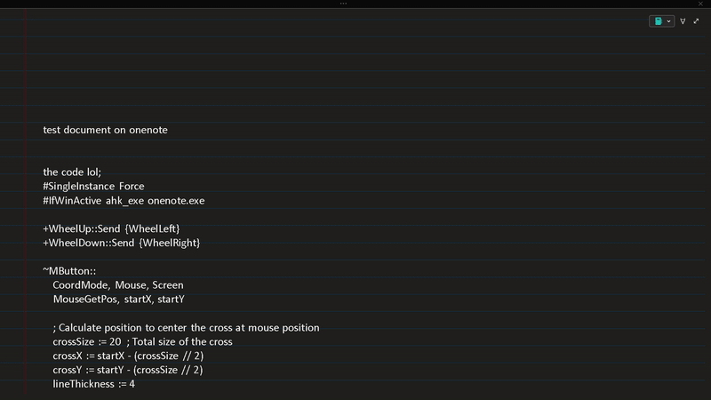
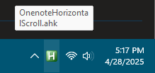

# OneNote Horizontal Scroll & Panning (Windows 11, AutoHotkey)

**Enhances OneNote navigation on Windows with horizontal scrolling and middle-click panning.**

This AutoHotkey script brings back two essential features that are missing in OneNote Desktop App for Windows but standard in other applications:

- **Shift + Scroll Wheel** for horizontal scrolling  
- **Middle Mouse Button drag** for smooth panning

The script only activates when OneNote is the active window. It’s lightweight, non-intrusive, and includes optional visual feedback (cursor and origin marker). Setup is quick, and you can optionally run it at startup.

## Features

- Horizontal scrolling with **Shift + Scroll Wheel**  
- Click-and-drag navigation with the **Middle Mouse Button**  
- **Visual feedback**: directional pan cursor and origin marker
- Only affects OneNote (won’t interfere with other apps)
- Written in **AutoHotkey v1**

<div align="center">
  <h3><u><code>Features Demo</code></u></h3>
</div>

<div align="center">
  <h3><u><strong>Shift + Scroll</strong> moves the page left and right</u></h3>
  
</div>

<div align="center">
  <p><strong>How it works:</strong></p>
</div>
<ul>
  <li>Hold <strong>Shift</strong></li>
  <li>Scroll using the <strong>mouse wheel</strong></li>
  <li>The page moves <strong>horizontally</strong> (left or right)</li>
  <li>Helps navigate wide layouts, tables, or images in OneNote</li>
</ul>

<br>

<div align="center">
  <h3><u><strong>Middle mouse button</strong> lets you click and drag to move around</u></h3>
  
</div>

<div align="center">
  <p><strong>How it works:</strong></p>
</div>
<ul>
  <li>Press and hold the <strong>middle mouse button</strong></li>
  <li>A small cross appears at the click point (this is the origin)</li>
  <li>Move the mouse in any direction to <strong>pan the canvas</strong></li>
  <li>The mouse cursor updates to show <strong>scroll direction</strong></li>
  <li>Release the middle button to stop panning</li>
</ul>

<div align="center">
  <h3><u><strong>Adjustability</strong></u></h3>
</div>

<ul>
  <li>Scroll speed increases the farther you move the mouse from the original click point</li>
  <li>You can customize this by editing the scroll thresholds in the script:</li>
</ul>

## Getting Started

### 1. Install AutoHotkey

Go to: [https://www.autohotkey.com/](https://www.autohotkey.com/)  
Download and install **AutoHotkey v1**

### 2. Create the Script

- Open Notepad or any text editor
- Paste the script (see below)
- Save the file with a `.ahk` extension, e.g., `onenote_scroll.ahk`

### 3. Run the Script

- Right-click the `.ahk` file
- Select **Show more options**
- Click **Run Script**

You should see a green AutoHotkey icon in the system tray (see image below)



*This tray icon confirms the script is active.*

Now:
- Shift + Scroll = horizontal scrolling
- Middle click and drag = panning mode

## Auto-run on Windows Startup (optional)

You have two options:

### Option 1: Add to Startup Folder

1. Press `Win + R`, type `shell:startup`, hit Enter  
2. Copy your `.ahk` file into this folder

### Option 2: Compile to EXE and Add to Startup

1. Right-click the `.ahk` file → Compile Script (creates `.exe`)
2. Move the `.exe` into `shell:startup`

I'm new to AutoHotkey and made this script quickly because I was used to the macOS OneNote app, which allows horizontal scrolling and panning by default. For some reason these features are missing on the Windows 11 OneNote Desktop App. 

## Contributing

Contributions are welcome! To contribute:

1. Fork the repository.  
2. Create a new branch:  
   ```bash
   git checkout -b feature/your-feature-name
   ```
3. Make your changes and commit with clear messages:  
   ```bash
   git commit -m "Add feature X"
   ```
4. Push your branch to GitHub:  
   ```bash
   git push origin feature/your-feature-name
   ```
5. Open a Pull Request describing your changes. 

## License

[](https://opensource.org/licenses/MIT)

This project is licensed under the MIT License. See the [LICENSE](LICENSE) file for details.

## Contact

For questions or feedback, reach out via email:
- **Email**: jred8069@gmail.com

